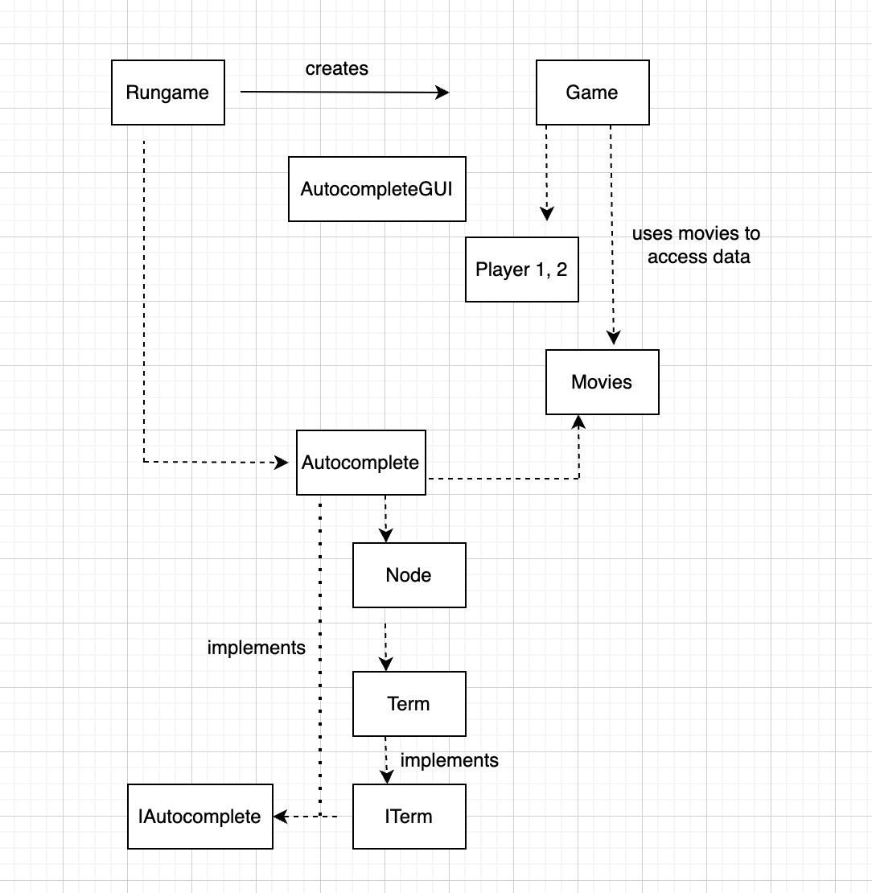

# Movie Battle Game

A 2-player movie connection game inspired by cine2nerdle.

## Features

- **Autocomplete GUI** for movie selection (with genre + cast filtering)
- **Two-player mode** with separate win conditions
- **Connection logic**: link movies via shared actor, director, writer, cinematographer, or composer
- **30-second timer** per turn (visual + enforced)
- **Progress tracking** toward genre-based goals
- **Link usage limits** (e.g., “Emma Stone” can only be used 3 times)
- **History tracking** of the last 5 played movies and their connection
- **Win conditions**:
  - Reach 5 valid movies in your target genre
  - Opponent fails to connect a valid movie in time

## How to Play

1. **Start the game**:
   ```
   java RunGame
   ```

2. **Each player** enters:
   - A username
   - A genre to win with (`Action`, `Comedy`, `Horror`, `Romance`, or `Drama`)

3. **Game begins** with a randomly selected movie.

4. On your turn:
   - An autocomplete GUI opens
   - You have 30 seconds to select a movie connected to the previous one

5. **Game ends** if:
   - A player fulfills their genre win condition (e.g., 5 horror films)
   - A player fails to connect within 30 seconds

## How Connections Work

Two movies are "connected" if they share **any** of the following:
- Actor
- Director
- Writer
- Cinematographer
- Composer

⚠️ Each individual (e.g., "Danny Elfman") can only be used as a link **up to 3 times** per player.

## File Structure

```
.
├── src/
│   ├── RunGame.java            # Main game loop and user prompts
│   ├── Game.java               # Core game logic
│   ├── Player.java             # Player state and progress
│   ├── Movies.java             # Movie database + connections
│   ├── AutocompleteGUI.java    # GUI for selecting movie titles
│   ├── autocomplete.txt        # Tab-separated [weight <TAB> movie name]
│   └── tmdb_data.txt           # Movie metadata (title|cast|genres)
```

## UML Diagram


## Prerequisites

- Java 17+
- IDE like IntelliJ or a terminal + `javac`
- Files:
  - `tmdb_data.txt`: your movie dataset
  - `autocomplete.txt`: formatted file for autocomplete (`0<TAB>Movie Title`)

## To Compile & Run

```bash
# Compile
javac *.java

# Run game
java RunGame
```